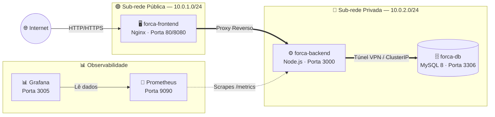

<div align="center">

# 🎯 Forca API — Cloud Native Hangman

*Uma API REST moderna para o clássico jogo da Forca, com arquitetura Cloud Native de nível Enterprise.*

[](https://github.com/Cacatuas-Aquaticas/forca.api/actions/workflows/production.yml)
[](https://github.com/Cacatuas-Aquaticas/forca.api/actions/workflows/staging.yml)
[](https://www.docker.com/)
[](https://kubernetes.io/)
[](https://www.terraform.io/)
[](https://nodejs.org/)
[](https://www.mysql.com/)
[](https://prometheus.io/)
[](https://grafana.com/)

</div>

---

## 📐 Arquitetura de 3 Camadas (3-Tier)




---

## 🏗️ Stack de Tecnologias

| Camada               | Tecnologia                               |
|----------------------|------------------------------------------|
| **Frontend**         | HTML5, CSS3, JavaScript, Nginx           |
| **Backend**          | Node.js 18, Express.js, Sequelize ORM    |
| **Banco de Dados**   | MySQL 8                                  |
| **Containerização**  | Docker, Docker Compose                   |
| **Orquestração**     | Kubernetes (K8s)                         |
| **IaC / Nuvem**      | Terraform, Google Cloud Platform (GCP)   |
| **Observabilidade**  | Prometheus, Grafana, `prom-client`       |
| **CI/CD**            | GitHub Actions                           |
| **Testes**           | Jest, Supertest                          |

---

## 🚀 Como Executar Localmente

### Pré-requisitos
- [Docker Desktop](https://www.docker.com/products/docker-desktop/) instalado
- [Node.js 18+](https://nodejs.org/) instalado

### 1. Clone o repositório
```bash
git clone https://github.com/Cacatuas-Aquaticas/forca.api.git
cd forca.api
```

### 2. Suba o Ambiente de Produção (Local)
```bash
docker-compose up --build -d
```

| Serviço        | URL                          |
|----------------|------------------------------|
| 🖥️ Frontend    | http://localhost:8080         |
| ⚙️ Backend API  | http://localhost:3000/api     |
| 📡 Metrics     | http://localhost:3000/metrics |
| 📊 Grafana     | http://localhost:3005         |
| 🔭 Prometheus  | http://localhost:9090         |

### 3. Suba o Ambiente de Homologação (Staging)
```bash
docker-compose -f docker-compose-staging.yml up --build -d
```

| Serviço                | URL                    |
|------------------------|------------------------|
| 🖥️ Frontend (Staging)  | http://localhost:8081   |
| ⚙️ Backend (Staging)   | http://localhost:3001   |
| 📊 Grafana (Staging)   | http://localhost:3006   |

---

## 🧪 Executar Testes

### Testes Unitários (Jest)
```bash
npm install
npm test
```
> Cobre controladores, serviços e modelos com mais de 20 testes automatizados.

### Testes de CRUD e Observabilidade
```bash
# Testa a API em Produção (padrão) ou informe outra URL:
bash test-crud.sh http://localhost:3000
```
O script validará todos os endpoints REST (Create, Read, Update, Delete) e confirmará que a rota `/metrics` está publicando dados para o Prometheus.

---

## 🔁 Pipelines CI/CD (GitHub Actions)

| Pipeline          | Trigger Branch | Ação                             |
|-------------------|----------------|----------------------------------|
| `production.yml`  | `main`         | Testa → Build → Deploy Produção  |
| `staging.yml`     | `develop`      | Testa → Build → Deploy Staging   |

---

## ☁️ Infraestrutura na Nuvem (Terraform + GCP)

A pasta `terraform/` contém os scripts de **Infraestrutura como Código (IaC)** para provisionar toda a arquitetura no Google Cloud Platform:

```
terraform/
├── main.tf         # VPC, Sub-redes Pública/Privada e Cloud NAT
├── firewalls.tf    # Grupos de Segurança (regras de rede isoladas)
└── compute.tf      # 3 VMs separadas: forca-frontend, forca-backend, forca-db
```

### 🔒 Justificativa de Segurança

| Recurso                 | Regra                                  | Justificativa                                                    |
|-------------------------|----------------------------------------|------------------------------------------------------------------|
| Frontend (`subnet-public`)  | Aberto para `0.0.0.0/0` (Porta 80)   | Usuários da internet precisam acessar a UI do jogo.              |
| Backend (`subnet-private`)  | Acesso restrito à sub-rede do Frontend | Impede exploração direta das rotas da API pela internet.         |
| Banco de Dados          | Acesso via **Túnel VPN** (IPsec/IPSec) | Tráfego criptografado, bloqueando ataques Man-in-the-Middle.     |

### Deploy na Nuvem
```bash
# 1. Instale o Terraform: https://developer.hashicorp.com/terraform/install
# 2. Autentique no GCP:
gcloud auth application-default login

# 3. Provisione a infraestrutura:
cd terraform
terraform init
terraform apply
```

---

## ⎈ Orquestração Kubernetes (K8s)

A pasta `k8s/` contém os manifestos declarativos para orquestrar a aplicação num cluster Kubernetes:

```
k8s/
├── namespaces.yaml         # Ambientes: production, staging, observability
├── frontend.yaml           # Deployment + Service LoadBalancer (IP Público)
├── backend.yaml            # Deployment + Service ClusterIP (interno)
├── db.yaml                 # Deployment + Service ClusterIP (interno)
└── network-policies.yaml   # Comunicação isolada entre pods
```

### Aplicar os Manifestos
```bash
# Criar os Namespaces
kubectl apply -f k8s/namespaces.yaml

# Subir os serviços em Produção
kubectl apply -f k8s/ -n forca-production
```

### Exposição dos Services

| Service               | Tipo            | Por quê?                                                        |
|-----------------------|-----------------|-----------------------------------------------------------------|
| `forca-frontend-svc`  | `LoadBalancer`  | Exige IP Público para que usuários acessem a UI.                |
| `forca-backend-svc`   | `ClusterIP`     | Acessível apenas de dentro do cluster — zero exposição externa. |
| `forca-db-svc`        | `ClusterIP`     | Banco de dados nunca fica acessível fora do cluster.            |

---

## 📡 Observabilidade (Prometheus + Grafana)

O backend exporta métricas automaticamente via a biblioteca `prom-client` na rota `/metrics`.

1. Acesse o **Grafana** em `http://localhost:3005` (usuário: `admin`, senha: `admin`)
2. Adicione o Prometheus como Data Source: `http://prometheus:9090`
3. Crie Dashboards com as métricas como `http_request_duration_seconds` e `process_cpu_seconds_total`

---

## 📂 Estrutura do Projeto

```
forca.api/
├── .github/workflows/     # Pipelines CI/CD (staging + production)
├── k8s/                   # Manifestos Kubernetes
├── terraform/             # Infraestrutura como Código (GCP)
├── src/
│   ├── controllers/       # Lógica dos endpoints
│   ├── models/            # Modelos Sequelize (ORM)
│   ├── routes/            # Rotas da API REST
│   └── services/          # Regras de negócio
├── public/                # Frontend estático (HTML, CSS, JS)
├── docker-compose.yml     # Ambiente de Produção
├── docker-compose-staging.yml # Ambiente de Homologação
├── Dockerfile             # Imagem Docker do Backend
├── Dockerfile.frontend    # Imagem Docker do Frontend (Nginx)
├── prometheus.yml         # Configuração do Prometheus
└── test-crud.sh           # Script de testes de CRUD e Observabilidade
```

---

<div align="center">
Feito com ☕ por <strong>Cacatuas Aquáticas</strong>
</div>
